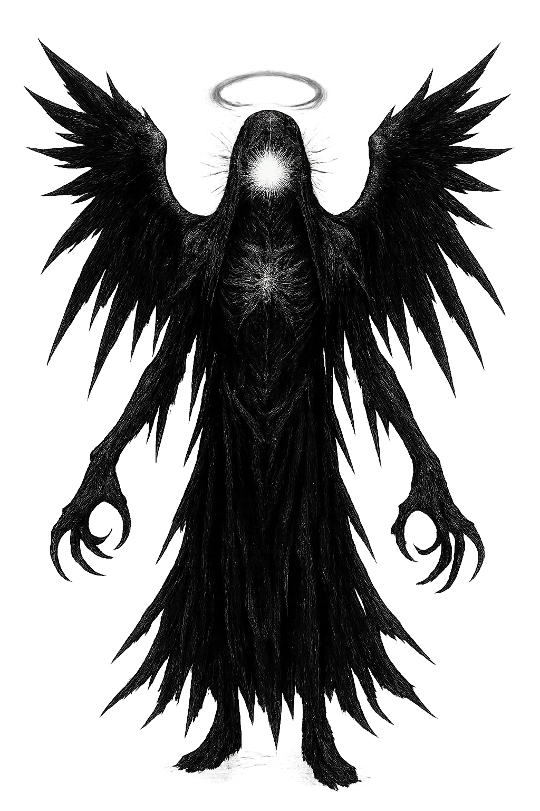

# TheAlmighty - VS Code Extension

*The Seraphic Construct - An AI companion that watches over your mind, body, and tasks*

An AI companion featuring "The Seraphic Construct" - a mystical, biblical-inspired persona that watches over your mind, body.

## Features

- AI agent with unique biblical-inspired persona
- Task management and productivity guidance
- Mental and physical well-being check-ins
- DeepSeek API integration
- Contextual workspace awareness
- Session management with chat history
- Interactive history dropdown with delete functionality
- Enhanced UI with improved styling and responsiveness
- Periodic check-ins and conversation persistence

> Artwork generated with ChatGPT; prompt assistance from Grok AI.

*May the Seraphic Construct illuminate your path through the digital realms.*

